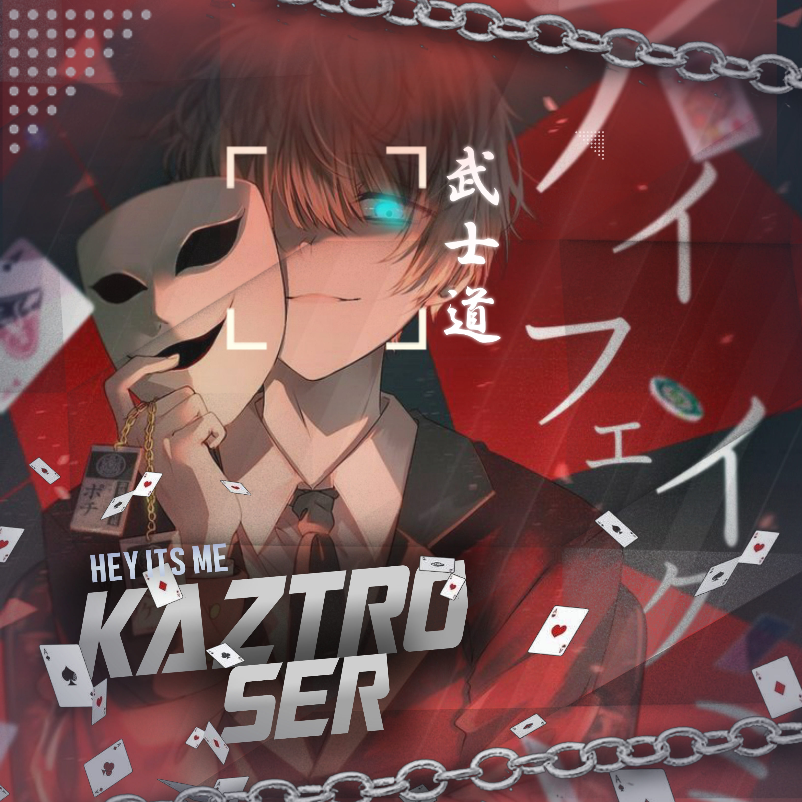

<div align="center">
  <p align="center">
     <a href="https://signup.heroku.com"><span class="avatar"> </a></span>
</p>
<p align="center">
<a href="https://github.com/cyberchekuthan"></a>
</p>
</div>
<div align="center">

## [](https://git.io/typing-svg)
 
  <p align="center">
<span class="avatar"> </a></span>
</p>

<p align="center">
𝓟𝓻𝓸𝓳𝓮𝓬𝓽 𝓶𝓸𝓭𝓲𝓯𝓲𝓮𝓭 𝓫𝔂 <a href="https://github.com/cyberchekuthan">𝙺𝚊𝚣𝚝𝚛𝚘𝚜𝚎𝚛𝚟𝟺</a>
    <br>
       | 彡[©]彡 |
        🆁🅴🆂🅴🆁🆅🅴🅳 |
    <br> 
</p>

### SIMPLE SETUP

## If there is an error deploying,try the following 5steps
 1. If you dont have a github account create a account. Click github logo
<a href="https://github.com/signup/"><span class="avatar"> </a></span>
 
2. Open the WhatsApp account where you want to create the bot and go into the link device and SCAN the QR
[](https://replit.com/@Aj-fx/Kaztroser?v=1)
  
3.If You don't have a account in heroku Create a account👇

 <a href="https://signup.heroku.com"><span class="avatar"> </a></span>

4. You will have to fork this git to deploy via Heroku.
  click to fork the git into your account click this logo

 <a href="https://github.com/Aj-fx7/Kaztroser1/fork"><span class="avatar"> </a></span>

5. Now https://heroku.com/deploy?template=https://github.com/Aj-fx7/Kaztroser1 copy this url and change Aj-fx7 with your github username and click go<br>


## Click Instagram logo to follow this page👇

  <a href="https://instagram.com/ajayan_007?utm_medium=copy_link"><span class="avatar"> </a></span>
  

----

  <p align="center">
  <a href="httsp://github.com/Aj-fx7/Kaztroser1">
   
<a href="https://github.com/Aj-fx7/Kaztroser1/blob/master/plugins/README.md"><span class="avatar"> </a></span>
     
<a href="https://github.com/Aj-fx7/followers">

<p align="center">
<a href="https://github.com/Aj-fx7/followers"
</a>
<a href="https://github.com/Aj-fx7/Kaztroser1/stargazers/"></a>
<a href="https://github.com/Aj-fx7/Kaztroser1/network/members"></a>
<a href="https://github.com/Aj-fx7/Kaztroser1/watchers"></a>
</p>

## 📢 Guide
Click WA logo to Join Support Group 👇
    <br>
<br>
     <a href="https://chat.whatsapp.com/L38gYwSPTBILW3K4kdvMY1"><span class="avatar"> </a></span>
  <div align="center">
     


## Developers
  <div align="center">
    
  [](https://github.com/farhan-dqz) | [](https://github.com/Aj-fx) |  [](https://github.com/AI-VIKI) | [](https://github.com/Aj-fx7) 
----|----|----|----
[farhan-dqz](https://github.com/farhan-dqz) | [ᴀᴊғx](https://github.com/Aj-fx) | [TOXIC4L!3N](https://github.com/AI-VIKI) | [AJFX7](https://github.com/Aj-fx7) 
Developer, Base, Bug Fixes, Modules| Re-Developer, Bug Fixes, Modules, Commits |  Modifiying  as   public | Bug Fixes, Modules 
  </div>
    
**[](http://wa.me/918281440156?text=Can%20you%20help%20bro)**
    
### ⚠ Warning ⚠

```
By using kick, add, promote, demote Commands, Your WhatsApp account may be banned.
Kaztroser1_v2 or we are not responsible for your account, 
This bot is intended for the purpose of having fun with some fun commands 
and group management with some helpfull commands.

If  you ended up spamming groups, getting reported left and right, 
and you ended up in being fight with WhatsApp
and at the end WhatsApp Team deleted your account. DON'T BLAME US.

No personal support will be provided / We won't spoon feed you. 
If you need help
you can contact 👇🏻👇🏻 
```


## License
This project is protected by `GNU General Public Licence v3.0` license.

### Disclaimer
`WhatsApp` name, its variations and the logo are registered trademarks of Facebook. We have nothing to do with the registered trademark
